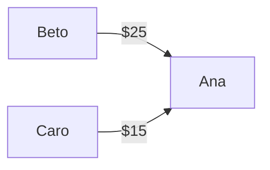

 # Splitty


A REST API for splitting shared expenses among groups: track who paid for what, compute everyone's balance, and get the minimal set of payments needed to settle up.

## Live demo

**Base URL:** `https://splitty-fvad.onrender.com`

> Hosted on Render's free tier, which sleeps after inactivity. The **first request may take 30–60 seconds** to wake the service — subsequent requests are fast. The free database is also time-limited, so the live demo may not be permanently available.

The API has no web frontend; interact with it using an API client (Postman, IntelliJ HTTP Client, `curl`, etc.). Public endpoints are `POST /auth/register` and `POST /auth/login`; everything else requires a JWT.

## Features

- **Groups** — create groups and manage their members, with owner/member roles.
- **Expenses with custom splits** — record an expense paid by one member and split it among the group in any amounts (not just evenly).
- **Balance calculation** — compute each member's net position (who is owed, who owes).
- **Debt simplification** — given the balances, compute the *minimal* set of transfers needed to settle everyone up, avoiding redundant back-and-forth payments.
- **Settlements** — record real payments between members to square up debts.
- **JWT authentication** — stateless auth; passwords hashed with BCrypt, protected endpoints require a bearer token.

## Tech stack

| Area | Technology |
|------|-----------|
| Language | Java 25 (LTS) |
| Framework | Spring Boot 4.1 (Web, Data JPA, Security, Validation) |
| Persistence | PostgreSQL, Hibernate (JPA) |
| Auth | JWT (jjwt), BCrypt |
| Testing | JUnit 5, Mockito |
| Build | Maven |
| Containerization | Docker, Docker Compose |
| CI | GitHub Actions |
| Deployment | Render |

## Architecture decisions

- **`BigDecimal` for all monetary values.** Money is never represented with `double` or `int`. Floating-point types can't represent decimal values exactly (`0.1 + 0.2 != 0.3`), and for an app whose entire job is splitting amounts that must sum precisely to a total, those rounding errors would break balance reconciliation. `BigDecimal` represents decimals exactly. Comparisons use `compareTo` (never `==`) to avoid scale pitfalls (`30` vs `30.00`).

- **`GroupMembership` as a join entity.** The User↔Group relationship isn't a plain many-to-many — each membership carries a **role**. Modeling it as its own entity (rather than a bare collection on `Group`) allows storing that extra data per membership, which is what makes the owner-only permission rules possible.

- **Enum for roles, not a boolean or string.** A member's role (`OWNER` / `MEMBER`) is a fixed, known set of values, so it's an `enum` — giving compile-time type safety (an invalid role can't be constructed) over a `String`, and room to extend beyond two values that a `boolean` wouldn't allow. Persisted with `@Enumerated(EnumType.STRING)` so reordering enum constants can't silently corrupt stored data.

- **DTOs to separate the API from the entities.** Controllers never expose JPA entities directly. Request/response DTOs define exactly what crosses the HTTP boundary — this keeps sensitive fields (e.g. password hashes) out of responses, prevents clients from setting fields they shouldn't, and decouples the public API from the database schema.

- **Per-group balance design.** Balances are calculated within the context of a group (`GET /groups/{id}/balances`), and the settle-up suggestion (`GET /groups/{id}/settle`) is scoped the same way. This keeps the debt model intuitive: you settle up *within* the group whose expenses created the debt.

- **Debt simplification as a computed result, not stored data.** The suggested "who pays whom" transfers are derived from the current balances on each request, never persisted — they'd go stale the moment an expense changed. Only real events (`Settlement`s) are stored. This same "don't store what you can derive" principle keeps the schema clean.

## Running locally

### Option A — Docker Compose (recommended)

Runs the app and a PostgreSQL database together in containers. Requires [Docker](https://www.docker.com/products/docker-desktop).

```bash
# Set the required secrets (JWT_SECRET must be at least 32 characters)
export DB_PASSWORD=yourpassword
export JWT_SECRET=your-long-secret-key-at-least-32-characters

docker compose up
```

The API will be available at `http://localhost:8080`.

### Option B — run against a local PostgreSQL

Requires Java 25, Maven, and a running PostgreSQL instance with a database named `splitty`.

Set the following environment variables (in your run configuration or shell):

```
DB_USERNAME=postgres
DB_PASSWORD=yourpassword
JWT_SECRET=your-long-secret-key-at-least-32-characters
```

Then:

```bash
mvn spring-boot:run
```

The app reads its datasource URL from `SPRING_DATASOURCE_URL` and falls back to `jdbc:postgresql://localhost:5432/splitty` if it isn't set.

## Testing

Unit tests cover the service layer, including the balance calculation and debt-simplification algorithm, using JUnit 5 and Mockito (repositories are mocked, so no database is required).

```bash
mvn test
```

Tests run automatically on every push and pull request via GitHub Actions.

## Example flow

1. `POST /auth/register` — create a user, receive a JWT.
2. `POST /auth/login` — log in, receive a JWT.
3. `POST /groups` — create a group (you become its owner).
4. `POST /groups/{id}/members` — add another user.
5. `POST /groups/{groupId}/expenses` — record an expense and its split.
6. `GET /groups/{groupId}/balances` — see each member's net balance.
7. `GET /groups/{groupId}/settle` — get the minimal list of payments to settle up.

All requests except register/login require an `Authorization: Bearer <token>` header.

# Debt Simplification

The core algorithmic feature of Splitty. Given all the expenses in a group, it answers: **what is the smallest set of payments that settles everyone up?**

## The problem

When people share expenses, debts pile up in tangled ways. Consider a group where, after a weekend trip:

- Ana is owed **$40**
- Beto owes **$25**
- Caro owes **$15**

A naive approach would replay every individual debt as its own payment. But that creates unnecessary transfers — money bouncing between people when it could be netted out. The goal is to settle all balances with as **few transfers** as possible.

## Step 1 — Calculate net balances

Before simplifying, each person is reduced to a single number: their **net balance**.

For every expense:
- The **payer** is credited the full amount they paid.
- Each participant is debited their **share** of that expense.

A person's net balance is therefore `(total they paid) − (total they owe)`:
- **Positive** → they are owed money (a *creditor*).
- **Negative** → they owe money (a *debtor*).
- **Zero** → already settled.

In a consistent group, all balances sum to zero — every dollar owed by someone is owed *to* someone.

## Step 2 — Simplify the debts

With net balances in hand, the algorithm produces the minimal transfer list using a **greedy** strategy:

1. Split people into two pools: **debtors** (negative balance) and **creditors** (positive balance).
2. Take the person who owes the most and the person who is owed the most.
3. Transfer the **smaller** of the two amounts between them — the largest payment that can happen in one move.
4. That settles at least one of them (their balance hits zero and they leave the pool); the other remains with a reduced balance.
5. Repeat until every balance is zero.

Because each transfer zeroes out at least one person, the algorithm never makes a wasted payment.

### Worked example

Starting balances: **Ana +40, Beto −25, Caro −15**.



- Biggest debtor **Beto (−25)** pays biggest creditor **Ana (+40)** the smaller amount, **$25**. Beto → 0 (settled), Ana → +15.
- Biggest debtor **Caro (−15)** pays **Ana (+15)**, **$15**. Both → 0.
- **Done in 2 transfers.**

### Why greedy beats replaying debts

The real payoff shows up with **circular debt**. Suppose:

- Ana owes Beto $10
- Beto owes Caro $10
- Caro owes Ana $10

Replaying each debt literally would mean **three** payments. But netting the balances, everyone is at **zero** — the cycle cancels out completely. The algorithm produces **zero transfers**. This is exactly the redundancy the simplification removes.

## Design decisions

- **Transfers are computed, never stored.** The output is a *suggestion* derived from the current balances on each request. It would go stale the instant an expense changed, so persisting it would be a bug. Only real, recorded payments (`Settlement`s) are stored. This follows a broader principle in the codebase: don't store what you can derive.

- **Balances are scoped per group.** Simplification runs within a single group, matching how the debt was actually incurred.

- **Exact comparison throughout.** Because balances are `BigDecimal`, all comparisons use `compareTo` rather than `==`, avoiding scale-related equality pitfalls (`30` vs `30.00`).

## Complexity

The simplification is `O(n²)` in the number of people with non-zero balances — each transfer removes at least one person from the pool, and finding the largest debtor/creditor each round is a linear scan. For expense-sharing groups (a handful of members), this is trivially fast; the design prioritizes clarity and correctness over micro-optimization at a scale where it wouldn't matter.

> Note: this greedy approach minimizes transfers effectively for realistic inputs. Finding the *provably* minimum number of transfers in every possible case is a harder problem (related to subset-sum), which is out of scope here — the greedy result is optimal or near-optimal for the group sizes this app targets.
